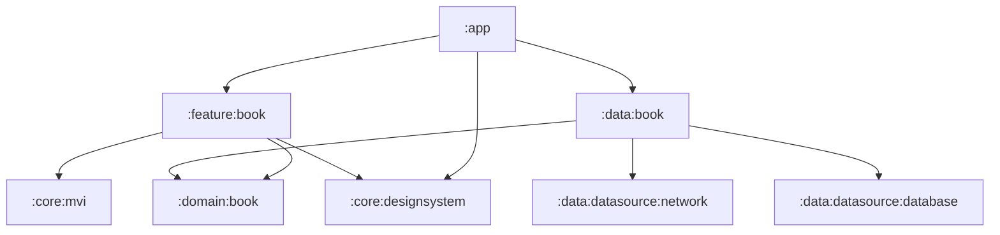
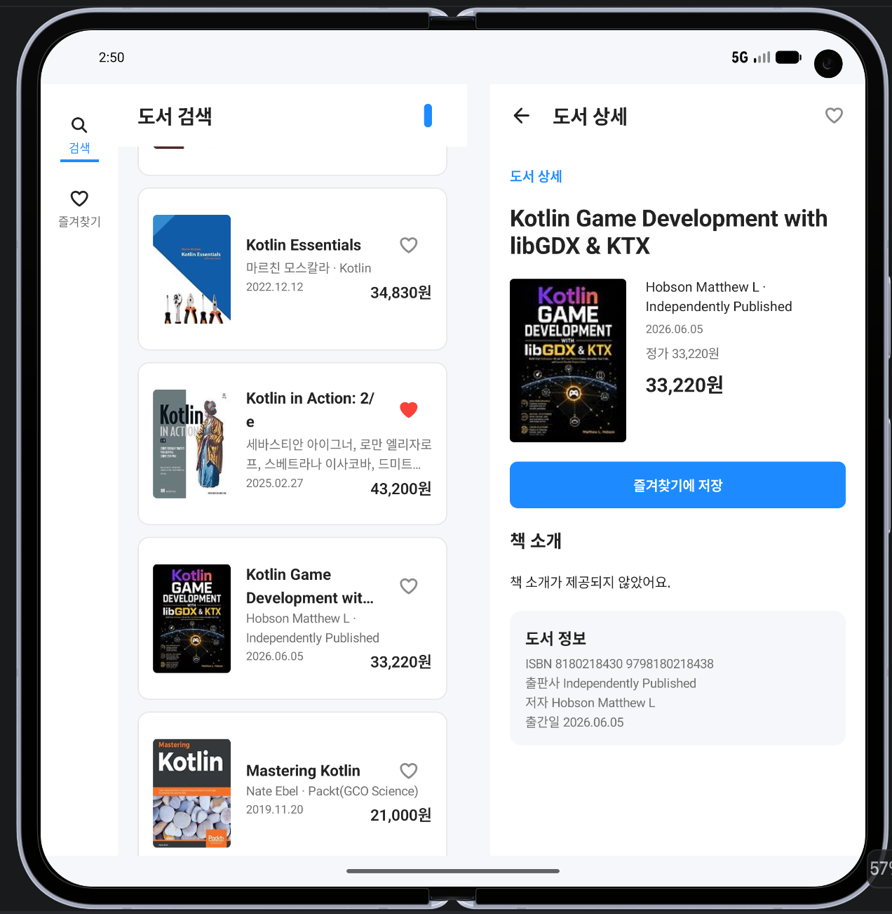

# BookShelf

- Kakao 도서 검색 API와 로컬 즐겨찾기를 사용하는 Android 앱

## 주요 기능

- **도서 검색**: 검색어 입력, 정확도순·발간일순 정렬, 20개 단위 자동 페이징
- **즐겨찾기**: 로컬 저장, 제목 검색, 제목 오름차순·내림차순 정렬, 가격 범위 필터
- **도서 상세**: 표지·제목·저자·출판사·출간일·가격·소개·ISBN 표시와 즐겨찾기 변경
- **적응형 화면**: 창 크기와 접힘 자세에 따른 탐색 UI 및 목록·상세 배치

## 빌드 및 실행

| 항목 | 버전 |
| --- | --- |
| JDK | 17 |
| Gradle / AGP | 9.4.1 / 9.2.1 |
| Kotlin / KSP | 2.4.0 / 2.3.10 |
| compileSdk / targetSdk / minSdk | 37 / 37 / 26 |

- Android Studio에서 프로젝트 열기
- Gradle JDK 17 설정, Android SDK Platform 37 설치
- 루트 `local.properties`에서 Android SDK 경로와 Kakao REST API 키 로드
- 제출 프로젝트에 키가 설정된 `local.properties` 포함
- `sdk.dir`은 실행 환경의 SDK 경로로 변경
- `local.properties`는 공개 Git 저장소에서 제외

```properties
sdk.dir=/path/to/Android/sdk
KAKAO_REST_API_KEY=your-rest-api-key
```

```sh
./gradlew assembleDebug
```

- APK 생성 경로: `app/build/outputs/apk/debug/app-debug.apk`

## 사용 기술

| 영역 | 기술 |
| --- | --- |
| UI | Jetpack Compose, Material3, Material3 Adaptive, Coil |
| 상태·비동기 처리 | ViewModel, Coroutines, StateFlow·SharedFlow, MVI |
| 내비게이션 | Navigation3, 화면별 ViewModel 스코프 |
| 의존성 주입 | Hilt |
| 원격 통신 | Retrofit, OkHttp, Kotlin Serialization |
| 로컬 저장 | Room |
| 테스트 | JUnit, MockK, kotlinx-coroutines-test, MockWebServer |


## 프로젝트 구조

| 모듈 | 책임 |
| --- | --- |
| `:app` | 앱 진입점, 도서 기능 연결, Hilt 조립 |
| `:feature:book` | 도서 화면·내비게이션, ViewModel, 화면 상태와 이벤트 |
| `:domain:book` | 순수 Kotlin 모델, Repository 계약, UseCase |
| `:data:book` | Repository 구현, 원격·로컬 데이터 조합, 캐시, 도메인 모델 변환 |
| `:data:datasource:network` | HTTP 클라이언트·통신 설정, API Service·응답 DTO |
| `:data:datasource:database` | Room DB, Entity·DAO |
| `:core:mvi` | Intent·State·Reducer·Effect와 BaseViewModel |
| `:core:designsystem` | 테마·아이콘과 공통 Compose 컴포넌트 |




## 주요 구현과 판단

### 상태 관리와 화면 이동

- **MVI**: 사용자 행동과 상태 변경을 단방향 흐름으로 관리, Reducer로 상태 전이를 명시하고 화면 이동·토스트는 일회성 Effect로 분리
- **ViewModel**: UI와 상태·조회 로직 분리, 화면 재구성·회전 시 상태 유지 및 상세 복귀 시 불필요한 재조회 방지

### 검색·페이징과 불안정한 네트워크

- **페이징**: 20개 단위 검색, 스크롤 위치에 따른 다음 페이지 조회
- **실패 처리**: 최초 조회 실패 시 재시도 제공, 다음 페이지 실패 시 기존 목록 유지 및 목록 하단에서 재시도
- **메모리 LRU 캐시**: 반복 조회·일시적인 연결 끊김 대응, 최대 5개 검색어의 응답을 최초 저장부터 5분간 보관하고 유효한 캐시가 있는 요청은 네트워크 없이 재사용

### 즐겨찾기와 도서 데이터

- **Room**: 즐겨찾기 도서 정보를 로컬에 저장, 앱 재실행 후에도 유지하고 오프라인 조회 지원
- **도서 ID**: ISBN을 식별자로 사용, ISBN10·ISBN13을 ISBN13으로 통일해 같은 판본의 중복 저장 방지

### 태블릿·폴더블

- **Navigation3·Material3 Adaptive**: 폴더블 기기의 창 크기·접힘 자세를 고려한 적응형 레이아웃, 넓은 화면에서 목록·상세를 나란히 표시하고 좁은 화면에서는 개별 화면으로 전환
- **정렬·가격 필터**: 600dp 미만에서 BottomSheet, 그 이상에서 Dialog 표시
- **검증 범위**: 넓은 화면 전환은 에뮬레이터에서 확인, 실제 기기의 힌지 경계·접힘 자세별 동작은 추가 검증 필요



## 검증

- 단위 테스트 범위: 도메인 입력·취소 처리, 응답 매핑·ISBN·캐시·Repository, HTTP 요청·응답, 화면 상태 전이

```sh
./gradlew :domain:book:test \
  :data:book:testDebugUnitTest \
  :data:datasource:network:testDebugUnitTest \
  :feature:book:testDebugUnitTest
```

- Room DAO 기기 테스트: 에뮬레이터 또는 기기 연결 후 실행

```sh
./gradlew :data:datasource:database:connectedDebugAndroidTest
```

- 개발 중 debug 빌드·단위 테스트 수행
- 실제 API 응답으로 ISBN 조합·마지막 페이지 처리 확인
- 에뮬레이터에서 상세 진입·복귀, 넓은 화면 전환 확인
- 네트워크 차단 시 추가 조회 실패·재시도 확인
- 오프라인 상세 복귀 후 목록·스크롤 유지 및 캐시 재사용 확인

## AI 활용

### 활용 범위

- **요구사항 정리**: 과제 요구사항을 바탕으로 PRD 정의 및 화면별 기능·상태·예외 상황 정리
- **디자인 생성**: PRD 정의 후 Figma MCP로 디자인 시스템과 화면 디자인 생성, 컴포넌트·화면 규격을 확인하며 Compose 구현에 반영
- **설계 검토**: 모듈별 책임과 의존성 방향 검토, 공개 API 범위와 상태 관리 방식의 대안 비교
- **빌드 기반 구성**: Gradle 설정과 convention plugin 초안 작성, 모듈 구성 및 Hilt 연결
- **기능 구현**: 도메인 계약과 데이터 계층 초안 작성, 검색·즐겨찾기·상세 Compose 화면 구현 및 리뷰에 따른 수정
- **테스트 작성**: 입력 조건과 실패·취소 상황을 바탕으로 테스트 케이스 및 검증 코드 작성
- **오류 분석**: 실제 API 로그와 에뮬레이터 동작을 바탕으로 ISBN 매핑·페이징·화면 복귀 문제 분석 및 수정
- **문서·PR 작성**: 기능별 AI 활용 기록 정리, 변경 내용과 검증 결과를 바탕으로 PR 설명 작성

### AI 결과를 어떻게 검증했는지

- **직접 리뷰**: AI 생성 결과물을 리뷰 모드에서 직접 검토하고, 의도와 다른 구현이나 개선이 필요한 부분을 지적해 수정 요청
- **테스트를 통한 확인**: 코드 생성 시 테스트 코드도 함께 작성하고 검증 조건을 검토, AI가 코드를 수정할 때마다 테스트를 실행해 기존 동작과 의도한 요구사항의 유지 여부 확인

### 직접 판단해 변경한 부분

- 기능별 설계 판단과 AI 결과를 수정한 내용은 [`docs/AI_USAGE.md`](docs/AI_USAGE.md) 참고
